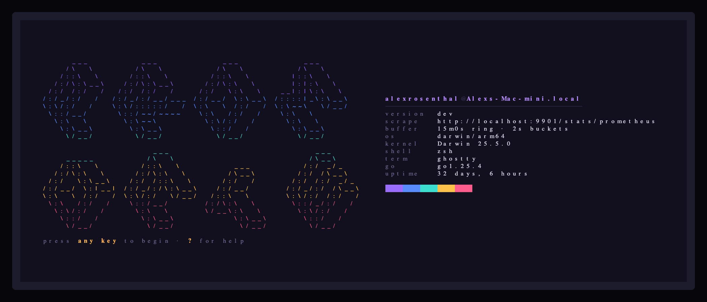
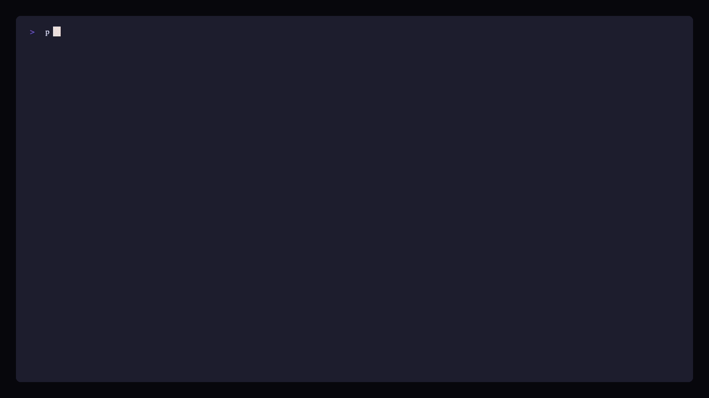

# prism

Split your metrics into their spectrum.

A terminal UI for Prometheus metrics, built on [Bubble Tea v2][bt] and
[Ultraviolet][uv], targeting Envoy's `/stats/prometheus` endpoint.



## Status

All eight phases of the rollout in [PLAN.md](PLAN.md): the lifecycle and lint
gates, streaming scrape into a ring buffer, the braille chart, spring-eased zoom
and pan, filtering with pivots, cardinality budgets with sampling, streaming
between instances, theming, and the Envoy end-to-end suite.



Everything above is prism recorded against the Envoy in [`deploy/`](deploy) —
553 real series on the run that produced these frames, and the two lines are the
two clusters at the rates the load generators are actually driving them. Every
image in `design/` is VHS output rather than a mockup; regenerate the set with
`task envoy-up && task tape && task artifacts`.

## Running it

Commands run through [Task](https://taskfile.dev); `task --list` describes them
all.

```sh
task deps          # resolve modules (go.mod ships unpinned on purpose)
task               # lint, test, build
PRISM_CONFIG=./config.example.yaml ./bin/prism
```

`PRISM_CONFIG` is the only environment variable prism reads. Everything else
lives in the YAML file it points at — see [config.example.yaml](config.example.yaml).
Unset it and prism looks in `/etc/prism/config.yaml`; if nothing is there, it
runs on defaults.

The `OTEL_*` variables are read directly by the OpenTelemetry SDK when
`telemetry.enabled` is true. They configure prism's own traces and metrics,
which have nothing to do with the metrics it scrapes.

## Keys

| | |
|---|---|
| `j` `k` | zoom the time window in and out |
| `h` `l` | pan back and forward through history |
| `L` | reattach to live |
| `g` | jump to the oldest bucket held |
| `↑` `↓` | select a series |
| `/` | filter, then enter to apply |
| `p` | pivot: split the family across a label |
| `d` | switch palette |
| `?` | key reference |
| `q` | quit |

`j`/`k` zoom rather than moving the selection, which is the one departure from
vi habits: the chart is the primary object on screen, so the home row belongs
to it.

## Filtering

```
cluster=api            exact
cluster!=api           negated
cluster=~outbound.*    regex, fully anchored
cluster!~inbound.*     negated regex
__name__=~envoy_http.* the metric family
upstream_rq            bare word: substring of the family name
```

Terms are separated by spaces or commas and combined with AND. Expressions are
compiled when you press enter, never during a frame.

Pressing `p` pivots the family across a label: every distinct value becomes one
summed line, and the tail past the line budget collapses into `other` with its
member count shown. A group keeps reporting while any of its members has data,
so a total does not drop out when one contributor misses a scrape.

## Cardinality

Each family has a budget (`scrape.family_budget`). Below it, every series is
stored and the cardinality is exact. Above it, prism keeps a stable uniform
sample — 1:2, then 1:4, then 1:8 — and counts the rest with a sketch, so memory
stays flat while cardinality climbs.

Anything the numbers do not literally mean is marked. A `~` is an estimate, a
`1:8` means the chart is drawn from an eighth of the series, and a `!` means the
family is past `scrape.cardinality_warn`. If any family on screen is sampled,
the status bar says so. A chart drawn from a subset that does not admit to being
one is the most dishonest thing this program could do.

## Watching through another prism

Set `stream.enabled` on one instance and point others at it:

```yaml
# the one that scrapes
stream: { enabled: true, address: 0.0.0.0:9099 }

# everyone else
stream: { upstream: http://ops-01:9099 }
```

A follower rebuilds the same store it would have built by scraping the target
itself, because frames carry samples rather than rendered state. prism either
scrapes or follows, never both: merging two clocks into one ring would
interleave samples that were never observed together.

Each subscriber holds one pending frame, not a queue. A slow consumer gets the
newest frame and a count of what it missed, so a viewer that cannot keep up
degrades to a coarser chart instead of growing memory on the instance doing the
scraping.

## Shape of the code

`main` handles signals and exit codes and nothing else. Everything is wired in
`app.Build`, which returns an `apphelpers.App` — even when it fails, so that a
half-built application can still be torn down. Startup functions run
concurrently; cleanup functions run sequentially in reverse.

Three rules are enforced by `depguard` rather than by convention:

- `internal/config` is importable only from `cmd/prism/main.go` and
  `internal/app/build.go`. Domain packages take values, not a config struct.
- The Charm v1 import paths are denied. Everything is `charm.land/*/v2`.
- `internal/tui` and `internal/chart` cannot import `net/http`, `database/sql`
  or `math/rand`. The render path is pure, which is what keeps a frame inside
  its budget and makes golden tests possible.

CI additionally fails on any hex colour outside `internal/theme`.

Motion is confined to `internal/motion` and only ever moves presentation
values — scales, offsets, panel heights. Data is never interpolated: a chart
that eases between two readings is drawing numbers nobody observed. One ticker
drives every animation and it stops the moment nothing is moving, so an idle
dashboard costs nothing.

## A target to point it at

[`deploy/`](deploy) stands up the thing prism was built against: Envoy, two
clusters over one backend, and three load generators at different rates so the
pivot has something to separate.

```sh
task envoy-up        # up, and waits until Envoy is serving stats with traffic in them
./bin/prism          # the default endpoint is already Envoy's admin listener
task envoy-down
```

`task envoy-fixture` re-records [`features/testdata/envoy-stats.txt`](features/testdata),
the exposition the acceptance suite replays.

## Acceptance criteria

`features/` holds the Gherkin the phases are graded against; `task bdd` runs
them with [godog][godog]. A phase is not done until its scenarios pass.

The Envoy scenarios run twice against the same bytes. `task bdd` replays the
recorded exposition, so the gate needs no container runtime; `task bdd-envoy`
runs the identical scenarios against a live admin port, which is how the
recording is caught aging. Both are Envoy's own output — the recording is not a
hand-written approximation of one.

The scenario worth reading is *Envoy is not special-cased*: the same exposition
is scraped twice, once with every `envoy_` rewritten to `wavelength_`, and the
two runs must agree on every family, kind and cardinality. Any branch on the
vendor's name makes the renamed run diverge, which is a stronger claim than
grepping the source for the word.

[bt]: https://github.com/charmbracelet/bubbletea
[uv]: https://github.com/charmbracelet/ultraviolet
[godog]: https://github.com/cucumber/godog
